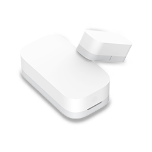
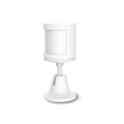
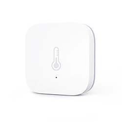
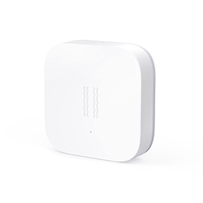

# Anidea for SmartThings &copy; Graham Johnson (orangebucket)
Assorted SmartThings bits and bobs that were created for use within the author's personal SmartThings environment, but hopefully to a standard that could potentially make them useful to others.

The following device handlers deliberately do not define a UI for the SmartThings Classic app:

- [Anidea for Lumi Devices](#anidea-for-lumi-devices)
  - [Anidea for Aqara Button](#anidea-for-aqara-button)
  - [Anidea for Aqara Contact](#anidea-for-aqara-contact)
  - [Anidea for Aqara Motion](#anidea-for-aqara-motion)
  - [Anidea for Aqara Temperature](#anidea-for-aqara-temperature)
  - [Anidea for Aqara Vibration](#anidea-for-aqara-vibration)
  - [Anidea for Mijia Contact](#anidea-for-mijia-contact)
- [Anidea for HTTP Motion](#anidea-for-http-motion)
- [Anidea for Virtual Devices](#anidea-for-virtual-devices)
  - [Anidea for Virtual Button](#anidea-for-virtual-button)
  - [Anidea for Virtual Binary](#anidea-for-virtual-binary)
  - [Anidea for Virtual Momentary](#anidea-for-virtual-momentary)
  - [Anidea for Virtual Presence](#anidea-for-virtual-presence)
  - [Anidea for Virtual Temperature](#anidea-for-virtual-temperature)

This device handler is perhaps a little more bespoke than the others and it still supports a UI in the Classic app:

- [LAN MultiThing](#lan-multithing)

## Anidea for Lumi Devices

The ['bspranger' device handlers](https://github.com/bspranger/Xiaomi) are the results of a cumulative community effort (largely driven by different single individuals at different times), to support the Mijia and Aqara brands of sensors made by Lumi, but generally referred to by the Xiaomi name. The sensors use Zigbee in a rather non-standard way and so they need special handling. SmartThings recognise their popularity enough to make some allowances for them, but neither they nor Lumi have created 'official' handlers. Although they are very effective, the handlers have a number of issues: they are very much rooted in the Classic environment; the logging might be considered a bit excessive and untidy; there are several custom attributes that don't really add anything; the Health Check support isn't quite right; and most of the settings are pretty much superfluous (for example, why have a UK / US date format setting when log messages are already timestamped?). 

The 'Anidea for ...' handlers strip things down and make them suitable for the 'new' environment. This includes completely removing the 'Tiles' and replacing with suitable metadata (if needed). A number of trials were made with custom manufacturer names and vendor IDs (a.k.a. Visualization Identifiers) which haven't been published and so presumably would not be available to all, but, although these could be made to work for the device pages, the dashboard tiles just wouldn't play ball. At the time of writing, with the architecture being undocumented, the Developer Workspace seemingly lagging well behind reality, and the support of capabilities being inconsistent, it seems easier to concede defeat and just work with what is available generically.

Although a lot of edits have been made to the device handlers, they remain underpinned by the code from the 'bspranger' handlers when it comes to the Zigbee side of things, and also when it comes to the maths used in the Vibration Sensor.

### Anidea for Aqara Button
This handler supports the same buttons as the 'bspranger' handler for Aqara buttons, but only the 'original version' of the WXKG11LM button (or 'Wireless Mini Switch') has actually been tested. The others hopefully should work but there is always the possibility that cosmetic changes to the code, and the odd bit of butchery, may have broken things. The most significant change is that it uses a broader ranger of button attribute values instead of using button numbers. The values used across the various buttons are:

* **pushed** (also used for the Momentary capability)
* **pushed_2x** (note, NOT double)
* **pushed_3x**
* **pushed_4x**
* **pushed_6x** (to represent 'shaken')
* **double** (to represent the hold release)
* **down_6x** (for a button press in the installation routine)

*The full range of attribute values is not available natively in webCoRE as that uses a lookup table which hasn't been updated. However the values can be used in a trigger condition by using an 'expression' instead of a 'value', and entering the event value as a double-quoted string e.g. `"pushed_2x"` (single quotes didn't work but this might have been because of other issues so needs to be tried again).*

### Anidea for Aqara Contact
The handlers for the Mijia and Aqara Door and Window sensors only truly differed in the fingerprints of the devices and how exactly the same on/off event was handled, so one handler now covers both options. Please be aware that the handler sets the status of the sensor to `closed` when it is installed (or updated via the IDE) as initialising the attributes just seems to make things work better. The custom commands to 'reset' the attribute to a known state have been retained, but renamed to `open()` and `close()` to match those in the Simulated Contact Sensor.

### Anidea for Aqara Motion
This supports the same Aqara motion sensors as the original, providing both Motion and Illuminance. The sensors do not send inactive reports so the device handler resets motion using a timer. A number of sensors have been used with a sixty second timer for a considerable time without any obvious issue, but as this matches the 'blind' period of the sensors, and SmartThings times aren't particularly precise, it seems better to relax the default period to 65 seconds to avoid any race condition.

During April 2020, the author experienced a considerable number of issues with the motion not being reset, and all the indications were that the timer event simply wasn't being received. For this reason, `active()` and `inactive()` custom commands have been added, matching the names used in the Simulated Motion Sensor, to allow the attribute to be 'reset' to a known state. The `active()` command does not set the timer.

### Anidea for Aqara Temperature
This supports the Aqara temperature and humidity sensors. The original extracted the atmospheric pressure but never gave it an attribute. It now uses the proposed Atmospheric Pressure Measurement capability with the `atmosphericPressure` attribute. The new app can work with this on the device pages, but not in Automations, and it is not recognised by the Developer Workspace yet. The default pressure unit seems to be 'kPa', but the device itself uses 'mbar', and in the absence of any location setting specifying the unit (as there is for temperature), it didn't seem to be the device handler's job to do any conversions.

At the time of writing, the most suitable metadata for UI purposes hasn't been determined.

### Anidea for Aqara Vibration
A handler for the vibration sensor is most of the way there, with any further changes likely to be cosmetic.

There is one major change from the original. The vibration is now mapped to the acceleration capability and the tilt to motion. The acceleration sensor capability is presented as a vibration sensor in the 'new' app and so it is an obvious change.

### Anidea for Mijia Contact
The [Anidea for Aqara Contact](#anidea-for-aqara-contact) covers both ranges.

## Anidea for HTTP Motion
A light in a room is switched automatically by a motion sensor at certain times of day. Very occasionally the room may also be occupied at those times and it would be a nuisance if the lights kept turning off because the occupants were watching the TV and not moving about. If it were possible to detect the TV is switched on then the automation could keep the lights on. Given the automation is working with a motion sensor it is likely to be able to handle a second one. Therefore a device handler which treats the TV being on as active motion would be rather handy.

This simple device handler does the job described above. Every fifteen minutes it attempts to connect an HTTP server on the IP address and port defined in the preferences. If the `parse()` command picks up the response the status is set to active. If no response is received within a minute the status is set to inactive. The `refresh()` command can also be used to check the status out of band, and custom `active()` and `inactive()` commands can be used to set the motion attribute directly.

*Polling more frequently than every fifteen minutes just seems like 'a bad thing'.*

*A number of users claimed that, if Smart Lighting was configured with multiple motion sensors, they didn't 'or' together when it came to inactivity timeouts. Several tests and months of usage suggested this was not the case. Unfortunately things seem to have changed and now the second motion sensor being active will not prevent inactivity timeouts.*

## Anidea for Virtual Devices
At the time the [Anidea for Virtual Button](#anidea-for-virtual-button) handler was created, there simply wasn't a stock handler that implemented a virtual button with the momentary capability and worked cleanly with the 'new' SmartThings mobile app. Once that was put together, consideration was given to adding support for the Switch capability, as used by the stock Momentary Button Tile handler, and also Contact Sensor and Motion Sensor capabilities as the author was vaguely aware that sort of thing was useful for working with Alexa. As adding those capabilities made the device details page look a bit of a mess, and more significantly made the `contact` attribute the default tile status instead of `button`, it was decided to create a separate handler instead, hence [Anidea for Virtual Momentary](#anidea-for-virtual-momentary).

It also seems to be useful to be able to do things like map `switch` attributes to `contact` attributes, and vice versa. Hence the [Anidea for Virtual Binary](#anidea-for-virtual-binary) handler.

Mobile presence has been using both the Presence Sensor and Occupancy Sensor capabilities for some time. The [Anidea for Virtual Presence](#anidea-for-virtual-presence) does likewise.

### Anidea for Virtual Binary
This handler implements a multiple attribute binary state device. The overall state is either active, or it is inactive, as expressed by a number of attributes from stock capabilities. When the handler receives any command to set an attribute active, it sets all enabled attributes to be active. When it receives any command to set an attribute to inactive, it sets all enabled attributes to be inactive. The supported attributes, which are all disabled by default and should be enabled as required using the device settings are:

|CAPABILITY|ATTRIBUTE|ACTIVE STATE|COMMAND|INACTIVE STATE|COMMAND|
|----------|---------|--------------|----------------|--------------|----------------|
|Contact Sensor|contact|open|open()|closed|close()|
|Motion Sensor|motion|active|active()|inactive|inactive()|
|Occupancy Sensor|occupancy|occupied|occupied()|unoccupied|unoccupied()|
|Presence Sensor|presence|present|arrived()|not present|departed()|
|Switch|switch|on|on()|off|off()|

The commands are consistent with those used by other 'Anidea for ...' device handlers. Those are derived from the capability where the device is an actuator, from the command used by stock 'Simulated ...' device handler where one is available, and lastly from whatever has been chose for use in other 'Anidea for ...' device handlers.

### Anidea for Virtual Button
This device handler implements the Button and Momentary capabilities and sends `pushed` events when the momentary tile is pressed in the new app, or the `push()` method is called from other apps e.g. webCoRE. The handler also supports the `down_6x` value of the button, but this is only used to seed the button attribute at start up, which is something that keeps the new app happy.

### Anidea for Virtual Momentary
This device handler implements a momentary action for the Contact Sensor, Motion Sensor and Switch capabilities. Although not really necessary, none of the actions are enabled by default and those required should be enabled via the device settings. Pressing the momentary tile, or calling the `push()` method sets the active states (`open`, `active` and `on`) as required, and then immediately resets them to the inactive states (`closed`, `inactive` and `off`).

*This handler could have been combined with the Virtual Button, but testing suggested the tile in the mobile app would default to the contact status rather than the button, and the device details screen was a bit too messy.*

### Anidea for Virtual Presence
The Simulated Presence Sensor doesn't allow for the Occupancy Sensor capability used in mobile presence. This handler supports both the Presence Sensor and Occupancy Sensor capabilities independently, and supports the `arrived()` and `departed()` custom commands to set presence, and uses `occupied()` and `unoccupied()` for occupancy.

### Anidea for Virtual Temperature
The Simulated Temperature Sensor uses Switch Level to give local control in the Classic app. However this confuses things in the 'new' app because the attribute `level` is never set. There are also issues because the units are never set in the events, and also there is an omission in that the level isn't updated when the temperature is changed remotely. This device handler has been written to work properly in the new app, and not at all in the Classic app. The `up()`, `down()` and `setTemperature()` custom commands allow the temperature to be incremented, decremented and set to a particular value, using the command names from the simulated sensor as a de facto standard.

The implementation of Switch Level in the UI for the new app doesn't seem to support anything but 0 to 100. To work with this, the handler defaults of a range of -40 C to 150 C, or -40 F to 302 F, depending on the temperature scale setting in the Location (there doesn't seem to be a way to change this in the new app, but it can be changed via the IDE). These values can be overridden in the settings. Temperature values below the 0% value, or above the 100% value, are changed to the minimum or maximum readings.

*The Switch Level capability in the device details doesn't seem to support entering 0%, and the Settings screen can be a little odd with 0 values too.*

*Please be aware that webCoRE recognised the `up()` and `down()` commands from another capability, and so presents them as 'Pan Camera Up' and 'Pan Camera Down'.*

## LAN MultiThing
This device handler implements the actuator capabilities Alarm, Audio Notification (see below), Configuration, Notification, Speech Synthesis, Switch and Tone by sending messages as HTTP GET messages in a format compatible with the AutoRemote WiFi Service and using AutoApps command format. There really is nothing magical about this and you can do absolutely anything you want with the commands at the other end. The author primarily uses it to implement a replacement for LANnouncer using the AutoRemote WiFi Service to provide an HTTP server for Tasker, and then Tasker to act on the commands.

The device handler is also capable of receiving 'pings' from the remote device sent as HTTP POST requests to port 39500 of the hub in JSON format. Currently these can be used to set the attribute states for the sensor capabilities Air Quality Sensor, Battery, Estimated Time Of Arrival, Motion Sensor, Power Source, Relative Humidity, Speech Recognition, Temperature and Ultraviolet Index, and also to set other variables in the device state map. Adding additional sensor capabilities requires adding the capability to the supported list, adding any UI tiles required, and possibly adding code to the parse() method for those capabilities that don't fit into the simple name and value model.

The device handler can also act as a bridge for individual devices supported by the remote device. There are currently child device handlers for the actuator capability Audio Notification ('Audio'), and the sensor capabilities Estimated Time Of Arrival ('ETA'), Motion Sensor and Speech Recognition ('STT'). These device handlers can be created and maintained independently of the parent device handler which doesn't need to know anything specific about them. The child devices send commands by calling methods on the parent, while the parent will forward incoming messages addressed to the child to the child's parse() method. The remote device should send a 'ping' with the list of child devices and these are then created (or deleted) when the updated() method is run (it is currently down to the user to do this, for example by saving the device preferences in the mobile app).

*It is possible to query the commands and attributes supported by capabilities on the fly. The commands reported for Audio Notification are consistent with the reference documentation. However the Speaker Companion app (previously Speaker Notify With Sound) uses commands which are not part of the Audio Notification or the now deprecated Music Player capabilities, or indeed any at all. They are device specific commands, which is utterly ridiculous. The two commands which have the same names will accept, and ignore, the extra parameter they may be called with by Speaker Companion. The other command is not supported at the moment.*

The device is specified by IP Address and Port in the Preferences, and the MAC address may also be specified (with or without colons and in upper, lower or mixed case). If the MAC address is provided it will be used as the Device Network ID (DNI), otherwise the IP Address and Port are combined in a hex form as the DNI. You might prefer to give your AutoRemote device a fixed IP address using a manual IP or a reserved IP address in your DHCP server. If the MAC address is not provided the incoming 'pings' will not work so a lot of functionality will be lost.

*The device network ID has to be either the MAC address or the hex IP:Port in order for SmartThings to send responses to the parse() method of a device handler. The MAC address is generally preferred and allows the device handler to receive out of band requests from the remote device on port 39500 on the hub. With the hex IP:Port this doesn't work as the remote source port would be completely different for these requests. Unfortunately if you have one device set up with the MAC address and another with the hex IP:Port the latter will not see the responses to its own requests. It would be nice if messages were forwarded based on IP:Port first and then MAC address but that isn't how it works.*

For capabilities that have a state, such as Alarm and Switch, the device handler waits for a response from the server on the device before setting the new state. This doesn't mean the command has worked, only that AutoRemote WiFi service has received it.

The HTTP GET requests are of the form `http://LAN IP ADDRESS:PORT/sendmessage?message=MESSAGE` where the MESSAGE is of the form `DEVICENAME=:=DEVICE DISPLAY NAME=:=CAPABILITY;=:=COMMAND=:=FREE TEXT=:=EXTRA`. The device handler doesn't allow any empty strings to make it to the remote end, with the exception of EXTRA, as Tasker doesn't really handle them elegantly. DEVICENAME is the 'name' property of the device with the spaces stripped out. So if you create your device with the name 'LAN MultiThing' it will be 'LANMultiThing'. DEVICE DISPLAY NAME is the 'displayName' property of the device, which may be different to the 'name' if you have defined it (it is called the 'label' in the IDE). DEVICE DISPLAY NAME, CAPABILITY, COMMAND, FREE TEXT and EXTRA are all URL encoded.

*The author likes to define the 'name' of a device, as shown in the IDE, as either the name of the device type handler (as in 'LAN MultiThing') or the specific make and model number of the device.*

If the free text used with the Notification or Speech Synthesis commands is of the form `COMMAND=:=FREE TEXT` the COMMAND and FREE TEXT will be extracted.

|CAPABILITY|COMMAND (State)|FREE TEXT|EXTRA||
|---|---|---|---|---|
|alarm|off|off|||
|alarm|siren|siren|||
|alarm|strobe|strobe|||
|alarm|both|both|||
|audioNotification|playTrack|&lt;uri&gt;|&lt;level&gt;||
|audioNotification|playTrackAndResume|&lt;uri&gt;|&lt;level&gt;||
|audioNotification|playTrackAndRestore|&lt;uri&gt;|&lt;level&gt;||
|configuration|configure|configure|||
|notification|deviceNotification|LAN MultiThing||Empty notification text replaced by dummy text.|
|notification|deviceNotification|&lt;free text&gt;||Notification without a valid command.|
|notification|&lt;command&gt;|&lt;free text&gt;||Notification with a valid command.|
|notification|&lt;command&gt;|deviceNotification||Notification only containing a command.
|speechSynthesis|speak|LAN MultiThing||Empty speech text replaced by dummy text.|
|speechSynthesis|speak|&lt;free text&gt;||Speech without a valid command.|
|speechSynthesis|&lt;command&gt;|&lt;free text&gt;||Speech with a valid command.|
|speechSynthesis|&lt;command&gt;|speak||Speech only containing a command.|
|switch|off|off|||
|switch|on|on|||
|tone|beep|beep|||

Incoming HTTP POST requests are sent to `http://HUB IP ADDRESS:39500/`, the content type is `application/json`, and the data is of the form:
  
<pre>{
    "device":"Device Display Name",
    "attribute": {
        "attribute1 name":"attribute1 value",
        "attribute2 name":{"attribute2 field1 name":"attribute2 field1 value"}
    },
    "state": {
        "state1 name":"state1 value",
        "state2 name":"state2 value"
    },
    "devices": [
        {"name":"child1 name", "type":"child1 type"},
        {"name":"child2 name", "type":"child2 type"}
    ]
}</pre>

The `"device":"Device Display Name",` entry is only used to address the messages to child devices, for example to set the child device attributes. The currently available types of child devices are 'Audio', 'ETA' and 'STT'.
